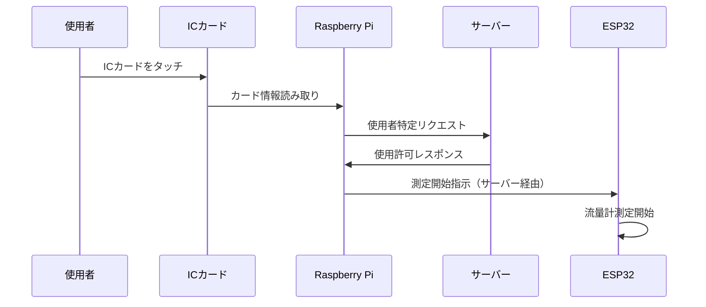
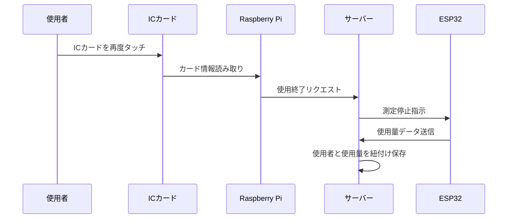

# 節電デバイス：流量計 + ICカード使用者特定システム実装ガイド

## 概要

共有スペースでの水使用量を測定し、ICカードによる使用者特定を行うシステムの実装について説明します。このシステムは以下の2つのハードウェアコンポーネントで構成されます：

- **ESP32**: 流量計による水使用量測定
- **Raspberry Pi**: ICカード読み取りによる使用者特定

## システム構成図

```
┌─────────────────┐    ┌──────────────────┐    ┌─────────────────┐
│     使用者      │    │    Raspberry Pi   │    │     ESP32       │
│                │    │                  │    │                │
│  ICカード       │───▶│  ICカード読取    │◀──▶│  流量計         │
│  をタッチ       │    │  (RC522/PN532)   │    │  測定           │
└─────────────────┘    └──────────────────┘    └─────────────────┘
                                │                        │
                                │                        │
                                ▼                        ▼
                       ┌─────────────────────────────────────┐
                       │        サーバー                     │
                       │    (AQUARIUMOTION API)             │
                       │                                    │
                       │ • 使用者特定                       │
                       │ • 使用量記録                       │
                       │ • データ統合                       │
                       └─────────────────────────────────────┘
```

## 通信方法の比較

### 1. サーバー経由通信（推奨）

**メリット:**
- **スケーラビリティ**: 複数の設置場所でも統一したシステム管理が可能
- **保守性**: 各デバイスが独立してメンテナンス可能
- **拡張性**: 将来的にリモート監視や統計機能の追加が容易
- **設置の自由度**: ESP32とRaspberry Piの設置場所を柔軟に選択可能
- **既存インフラ活用**: 既存のAPI端点を活用可能

**デメリット:**
- **ネットワーク依存**: インターネット接続が必要
- **わずかな遅延**: サーバーを経由するため数秒の遅延が発生する可能性

**実装方法:**
```
Raspberry Pi → AQUARIUMOTION API → ESP32
ESP32 → AQUARIUMOTION API → ユーザーアプリ
```

### 2. 有線直接通信

**メリット:**
- **低遅延**: 直接通信のため遅延が最小
- **ネットワーク非依存**: インターネット接続に依存しない

**デメリット:**
- **配線の制約**: 物理的な配線が必要（最大数メートル）
- **保守性の低下**: 一方のデバイストラブルで全体に影響
- **拡張性の制限**: 複数設置時の管理が複雑
- **プロトコル開発**: 独自の通信プロトコル開発が必要

**推奨判断: サーバー経由通信**

共有スペースでの設置、将来の拡張性、既存システムとの統合を考慮すると、**サーバー経由通信**を推奨します。

## ICカード読み取り技術仕様

### 使用可能なICカード規格

1. **MIFARE Classic（推奨）**
   - 最も一般的な規格
   - 読み取り装置が安価
   - Raspberry Pi対応ライブラリが豊富

2. **FeliCa**
   - 日本で普及（Suica、nanaco等）
   - 高セキュリティ
   - 読み取り速度が高速

3. **MIFARE DESFire**
   - 高セキュリティ要求時
   - 企業での内部システムに適用

### Raspberry Pi ICカード読み取りモジュール

**RC522 RFID リーダー（推奨）**
- 対応規格: MIFARE Classic
- 通信: SPI
- 価格: 約1,000円
- Python ライブラリ: `mfrc522`

**PN532 NFC モジュール**
- 対応規格: MIFARE Classic, FeliCa
- 通信: I2C, SPI, UART
- 価格: 約2,000円
- Python ライブラリ: `pn532`

## ハードウェア構成

### ESP32側（流量計）

**必要コンポーネント:**
- ESP32 DevKit
- 水流量センサー（例：YF-S201）
- 電源回路
- WiFi接続用アンテナ

**センサー仕様:**
- 流量範囲: 1-30L/min
- パルス出力: 1L = 約450パルス
- 電源: 5V DC
- 出力: デジタルパルス

### Raspberry Pi側（ICカード読み取り）

**必要コンポーネント:**
- Raspberry Pi 4
- RC522 RFID リーダー
- LED/ブザー（読み取り確認用）
- micro SD カード
- 電源アダプター

## システムフロー

### 1. 使用開始フロー



### 2. 使用終了フロー



## API設計

### 新規エンドポイント

#### 1. 使用開始API

```
POST /api/start-water-usage
```

**リクエスト:**
```json
{
  "cardId": "IC_CARD_UNIQUE_ID",
  "deviceId": "water_flow_device_001",
  "timestamp": "2025-01-16T12:00:00.000Z"
}
```

**レスポンス:**
```json
{
  "success": true,
  "data": {
    "sessionId": "session_xxxxxxxx",
    "userId": "user_xxxxxxxx",
    "startTime": "2025-01-16T12:00:00.000Z"
  }
}
```

#### 2. 使用終了API

```
POST /api/end-water-usage
```

**リクエスト:**
```json
{
  "cardId": "IC_CARD_UNIQUE_ID",
  "sessionId": "session_xxxxxxxx",
  "waterAmount": 15.5,
  "timestamp": "2025-01-16T12:05:00.000Z"
}
```

#### 3. ICカード登録API

```
POST /api/register-ic-card
```

**リクエスト:**
```json
{
  "cardId": "IC_CARD_UNIQUE_ID",
  "userId": "user_xxxxxxxx",
  "cardName": "田中さんのカード"
}
```

## 実装例

### Raspberry Pi（ICカード読み取り）

```python
#!/usr/bin/env python3
import RPi.GPIO as GPIO
from mfrc522 import SimpleMFRC522
import requests
import time
import json

# RC522リーダー初期化
reader = SimpleMFRC522()

# API設定
API_BASE_URL = "https://aquariumotion.vercel.app/api"
API_KEY = "aquarium-esp32-secure-key-2024"

def read_ic_card():
    """ICカードを読み取り"""
    try:
        print("ICカードをリーダーにタッチしてください...")
        id, text = reader.read()
        return str(id)
    except Exception as e:
        print(f"カード読み取りエラー: {e}")
        return None

def start_water_usage(card_id, device_id):
    """水使用開始"""
    url = f"{API_BASE_URL}/start-water-usage"
    headers = {
        "Content-Type": "application/json",
        "x-api-key": API_KEY
    }
    data = {
        "cardId": card_id,
        "deviceId": device_id,
        "timestamp": time.strftime("%Y-%m-%dT%H:%M:%S.000Z", time.gmtime())
    }

    try:
        response = requests.post(url, headers=headers, json=data)
        if response.status_code == 200:
            return response.json()
        else:
            print(f"使用開始失敗: {response.status_code}")
            return None
    except Exception as e:
        print(f"通信エラー: {e}")
        return None

def end_water_usage(card_id, session_id):
    """水使用終了"""
    url = f"{API_BASE_URL}/end-water-usage"
    headers = {
        "Content-Type": "application/json",
        "x-api-key": API_KEY
    }
    data = {
        "cardId": card_id,
        "sessionId": session_id,
        "timestamp": time.strftime("%Y-%m-%dT%H:%M:%S.000Z", time.gmtime())
    }

    try:
        response = requests.post(url, headers=headers, json=data)
        return response.status_code == 200
    except Exception as e:
        print(f"通信エラー: {e}")
        return False

def main():
    device_id = "water_flow_device_001"
    current_session = None

    print("水使用量測定システム開始")

    while True:
        card_id = read_ic_card()
        if card_id:
            if current_session is None:
                # 使用開始
                result = start_water_usage(card_id, device_id)
                if result and result["success"]:
                    current_session = {
                        "sessionId": result["data"]["sessionId"],
                        "cardId": card_id,
                        "userId": result["data"]["userId"]
                    }
                    print(f"使用開始: {current_session['userId']}")
                else:
                    print("使用開始に失敗しました")
            else:
                # 使用終了
                if card_id == current_session["cardId"]:
                    if end_water_usage(card_id, current_session["sessionId"]):
                        print(f"使用終了: {current_session['userId']}")
                        current_session = None
                    else:
                        print("使用終了に失敗しました")
                else:
                    print("異なるカードです")

        time.sleep(1)

if __name__ == "__main__":
    try:
        main()
    except KeyboardInterrupt:
        print("\nシステム終了")
    finally:
        GPIO.cleanup()
```

### ESP32（流量計測定）

```cpp
#include <WiFi.h>
#include <HTTPClient.h>
#include <ArduinoJson.h>

// WiFi設定
const char* WIFI_SSID = "YOUR_WIFI_SSID";
const char* WIFI_PASSWORD = "YOUR_WIFI_PASSWORD";

// 流量センサー設定
const int FLOW_SENSOR_PIN = 2;
volatile int flowPulseCount = 0;
float flowRate = 0.0;
float totalLiters = 0.0;
unsigned long oldTime = 0;

// セッション管理
String currentSessionId = "";
bool measuring = false;

// 流量センサー割り込み
void IRAM_ATTR flowPulseCounter() {
    flowPulseCount++;
}

void setup() {
    Serial.begin(115200);

    // WiFi接続
    WiFi.begin(WIFI_SSID, WIFI_PASSWORD);
    while (WiFi.status() != WL_CONNECTED) {
        delay(500);
        Serial.print(".");
    }
    Serial.println("WiFi接続完了");

    // 流量センサー設定
    pinMode(FLOW_SENSOR_PIN, INPUT_PULLUP);
    attachInterrupt(digitalPinToInterrupt(FLOW_SENSOR_PIN), flowPulseCounter, FALLING);

    Serial.println("水流量測定システム開始");
}

void loop() {
    // サーバーからの指示をチェック
    checkServerCommands();

    if (measuring) {
        // 流量計算（1秒ごと）
        if ((millis() - oldTime) > 1000) {
            // 流量計算 (L/min)
            flowRate = ((1000.0 / (millis() - oldTime)) * flowPulseCount) / 450.0; // 450 pulses per liter
            oldTime = millis();

            // 総使用量累積
            totalLiters += (flowRate / 60.0); // 1秒分の使用量

            flowPulseCount = 0;

            // デバッグ出力
            Serial.printf("Flow rate: %.2f L/min, Total: %.3f L\n", flowRate, totalLiters);
        }
    }

    delay(100);
}

void checkServerCommands() {
    // サーバーから測定開始/終了指示をチェック
    HTTPClient http;
    http.begin("https://aquariumotion.vercel.app/api/check-flow-commands");
    http.addHeader("Content-Type", "application/json");

    DynamicJsonDocument doc(512);
    doc["deviceId"] = "water_flow_device_001";

    String jsonString;
    serializeJson(doc, jsonString);

    int httpResponseCode = http.POST(jsonString);

    if (httpResponseCode == 200) {
        String response = http.getString();
        DynamicJsonDocument responseDoc(1024);
        deserializeJson(responseDoc, response);

        String command = responseDoc["command"];

        if (command == "start") {
            currentSessionId = responseDoc["sessionId"];
            startMeasurement();
        } else if (command == "stop") {
            stopMeasurement();
        }
    }

    http.end();
}

void startMeasurement() {
    if (!measuring) {
        measuring = true;
        totalLiters = 0.0;
        flowPulseCount = 0;
        oldTime = millis();
        Serial.println("測定開始: " + currentSessionId);
    }
}

void stopMeasurement() {
    if (measuring) {
        measuring = false;

        // 使用量をサーバーに送信
        sendUsageData();

        Serial.printf("測定終了: %.3f L\n", totalLiters);
        currentSessionId = "";
        totalLiters = 0.0;
    }
}

void sendUsageData() {
    HTTPClient http;
    http.begin("https://aquariumotion.vercel.app/api/log-device-usage");
    http.addHeader("Content-Type", "application/json");
    http.addHeader("x-api-key", "aquarium-esp32-secure-key-2024");

    DynamicJsonDocument doc(1024);
    doc["deviceId"] = "water_flow_device_001";
    doc["sessionId"] = currentSessionId;
    doc["usageType"] = "water";
    doc["amount"] = totalLiters;

    String jsonString;
    serializeJson(doc, jsonString);

    int httpResponseCode = http.POST(jsonString);

    if (httpResponseCode == 200) {
        Serial.println("使用量データ送信成功");
    } else {
        Serial.println("使用量データ送信失敗: " + String(httpResponseCode));
    }

    http.end();
}
```

## セキュリティ考慮事項

### ICカードセキュリティ
- **カードID暗号化**: ICカードIDは暗号化してサーバーに送信
- **認証タイムアウト**: 一定時間後の自動ログアウト機能
- **不正利用検知**: 異常な使用パターンの検知

### 通信セキュリティ
- **HTTPS通信**: 全ての通信でHTTPS使用
- **API認証**: x-api-keyによる認証
- **データ検証**: 送信データの妥当性チェック

### プライバシー保護
- **使用者情報の匿名化**: ログには使用者を特定できない形式で記録
- **データ保存期間制限**: 個人利用データの保存期間を制限

## 運用・保守

### 監視項目
- **デバイス稼働状況**: 定期的な死活監視
- **データ精度**: 流量センサーの精度確認
- **ICカード読み取り成功率**: 読み取り失敗率の監視

### メンテナンス
- **流量センサー清掃**: 定期的な清掃によるデータ精度維持
- **ICカードリーダー清掃**: 読み取り精度維持
- **ファームウェア更新**: セキュリティ更新とバグ修正

### トラブルシューティング
- **読み取り失敗**: ICカードまたはリーダーの清掃
- **流量データ異常**: センサー配管の確認
- **通信エラー**: ネットワーク接続の確認

## 導入手順

1. **ハードウェア準備**: ESP32、Raspberry Pi、センサー等の調達
2. **API実装**: サーバー側の新規エンドポイント実装
3. **デバイス設定**: 各デバイスのファームウェア書き込み
4. **ICカード配布**: 使用者へのICカード配布と登録
5. **システムテスト**: 総合的な動作確認
6. **運用開始**: 実際の使用環境での稼働開始

このシステムにより、共有スペースでの水使用量を正確に測定し、使用者ごとの節約行動促進が可能になります。